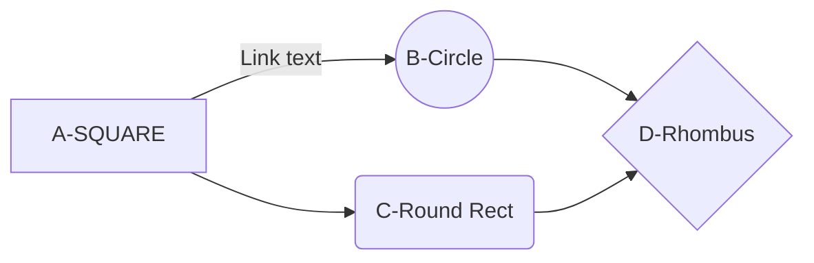
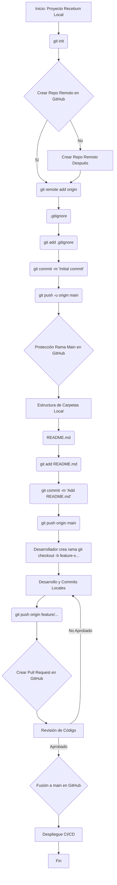

# Readme for Amazing Code

### I've test **PULL**

```mermaid
graph LR
    AA[A-SQUARE] -- Link text --> BB((B-Circle))
    AA --> CC(C-Round Rect)
    BB --> DD{D-Rhombus}
    CC --> DD
```
   

```mermaid
graph TD
    A[Inicio: Proyecto Recetium Local] --> B(git init);
    B --> C{Crear Repo Remoto en GitHub};
    C -- Sí --> D(git remote add origin);
    C -- No --> E[Crear Repo Remoto Después];
    D --> F(.gitignore);
    F --> G(git add .gitignore);
    G --> H(git commit -m 'Initial commit');
    H --> I(git push -u origin main);
    I --> J{Protección Rama Main en GitHub};
    J --> K[Estructura de Carpetas Local];
    K --> L(README.md);
    L --> M(git add README.md);
    M --> N(git commit -m 'Add README.md');
    N --> O(git push origin main);
    O --> P[Desarrollador crea rama git checkout -b feature-x...];
    P --> Q[Desarrollo y Commits Locales];
    Q --> R(git push origin feature/...);
    R --> S{Crear Pull Request en GitHub};
    S --> T[Revisión de Código];
    T -- Aprobado --> U{Fusión a main en GitHub};
    U --> V[Despliegue CI/CD];
    T -- No Aprobado --> Q;
    V --> W[Fin];
    E --> D;
```